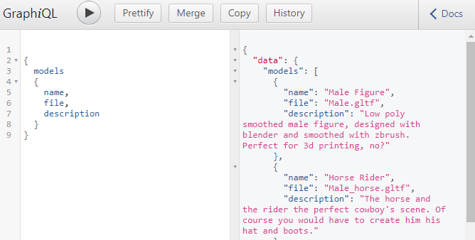

<h1 align="center">
  <br>
 
  <br>
    3d Backend
  <br>
</h1>

<h4 align="center">A simple Express - Graphql static 3d files server hosted in  <a href="https://vercel.com/" target="_blank">Vercel</a>.</h4>

<p align="center">


<a href='https://github.com/shivamkapasia0' target="_blank"></a>
<a href='https://github.com/shivamkapasia0' target="_blank"></a>
<a href='https://github.com/shivamkapasia0' target="_blank"></a>
<a href='https://github.com/shivamkapasia0' target="_blank"></a>
</p>

<p align="center">Badges from <a href="https://kapasia-dev-ed.my.site.com/Badges4Me/s/" target="_blank">Kapasia</a> and <a href="https://github-badges.netlify.app/" target="_blank"> Gh badges</a> </p>

<p align="center">
  <a href="#key-features">Key Features</a> •
  <a href="#how-to-use">How To Use</a> •
  <a href="#credits">Credits</a> 
</p>

<p align="center"></p>

## Key Features

- Static 3d files `(.gltf)` served
  - All the files at `/public` folder are served thanks to express static feature
  ```js
  app.use("/public", express.static(path.join(__dirname, "public")));
  ```
- Graphql API
  - Simple get API built with graphql

## How To Use

To clone and run this application, you'll need [Git](https://git-scm.com) and [Node.js](https://nodejs.org/en/download/) (which comes with [npm](http://npmjs.com)) installed on your computer. From your command line:

```bash
# Clone this repository
$ git clone https://github.com/Dalejan/3d-backend.git

# Go into the repository
$ cd cd 3d-backend

# Install dependencies
$ npm install

# Run the server
$ npm start
```

Once the server is on you can go to `http://localhost:8080/graphql` to watch the graphiql interface where you can test the `models` query

```js
{
    models {
        name,
        file,
        description
    }
}
```

> **Note**
> If you're using Linux Bash for Windows, [see this guide](https://www.howtogeek.com/261575/how-to-run-graphical-linux-desktop-applications-from-windows-10s-bash-shell/) or use `node` from the command prompt.

## Credits

This software uses the following open source packages:

- [Graphql](https://graphql.org/)
- [Node.js](https://nodejs.org/)
- [Cors](https://www.npmjs.com/package/cors)
- [Express](https://expressjs.com/)

## You may also like...

- [3d-landing](https://github.com/Dalejan/3d-landing) - The frontend that consumes this backend

---

Built with <span role="img" aria-label="heart emoji">💖</span> By David Alejandro Quiñonez

> GitHub [@Dalejan](https://github.com/Dalejan)

More social network later :D
